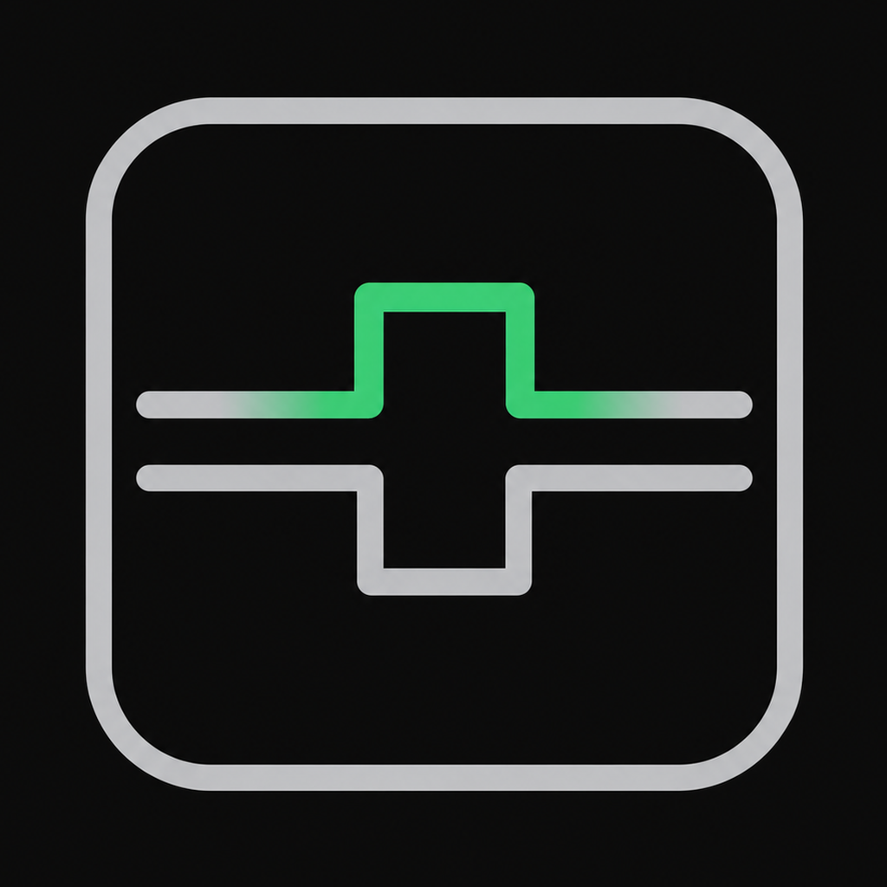
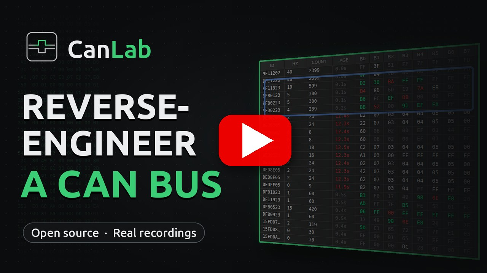
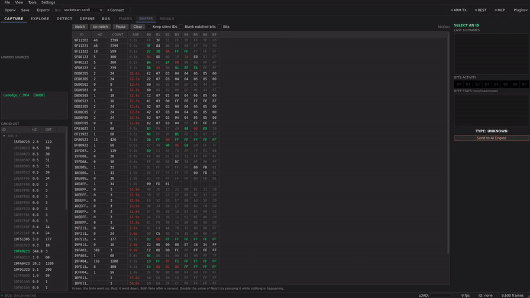

<p align="center">
  
</p>

# CanLab

**A desktop workstation for reverse-engineering a CAN bus.**

[](https://www.python.org)
[](https://pypi.org/project/PyQt6/)
[](#testing)
[](LICENSE)

Load a capture, work out which bytes carry what, write the signal definitions
down, check them against real frames, and export a DBC that other tools can
read. It also speaks the diagnostic protocols (UDS, ISO-TP, J1939, OBD-II, XCP,
DoIP), and, for isolated bench use only, can inject, replay, fuzz and bridge.

> **Status:** beta. Single-author project, actively developed. It runs, and the
> behaviour described here is covered by an automated suite of 578 tests (see
> [Testing](#testing)). But the analysis methods are heuristics that suggest
> candidates rather than identify signals, some features need optional
> dependencies, and it has not been validated across a wide range of real
> vehicles. Read [Limitations](#limitations) before relying on a result.

**Watch:** [the guided tour on YouTube](https://www.youtube.com/watch?v=nbDBaClN8T8) (6 min)

**Contents:** [Safety](#safety) · [Install](#install-and-run) · [Demo](#demo) ·
[Interface](#the-interface) · [Workflow](#a-typical-session) ·
[Tabs](#what-it-does-16-tabs) ·
[Log formats](#supported-log-formats) ·
[Analysis](#analysis-offline-no-api-key) ·
[Vehicle profiles](#vehicle-profiles) · [Diagnostics](#diagnostics) ·
[DBC](#dbc-ecosystem) · [Integrations](#integrations) ·
[Architecture](#how-it-fits-together) · [Real data](#validated-against-real-captures) · [Testing](#testing) ·
[Limitations](#limitations)

---

## Safety

> CanLab can transmit on a CAN bus. **Use it only on isolated bench setups:** a
> benchtop ECU, `vcan0`, or dedicated lab hardware. Injecting or forwarding
> frames on a live vehicle bus can interfere with braking, steering and airbag
> systems.
>
> Four guards are built in:
>
> 1. A safety warning you have to accept on first launch. The acceptance is
>    remembered, so it appears once.
> 2. A global **ARM TX** toolbar toggle, **disarmed by default**. Nothing leaves
>    the tool until you arm it: not injection, replay, fuzzing or gateway
>    forwarding, and not diagnostic requests either (UDS, OBD-II, XCP, DoIP).
>    Every transmit path goes through one function, and a test asserts that each
>    of them stays silent while disarmed.
> 3. Disarming stops transmits that are already running. It does not merely
>    block the next frame: a fuzzer or replay in flight is asked to stop and
>    joined.
> 4. A blocked-ID list that is refused even while armed.
>
> The UDS service scan probes read-only services unless you tick "Include
> destructive services" and confirm.

---

## Documentation

Full documentation, with the walkthrough videos playing in the page:
**[sherin-sef-ai.github.io/CanLab](https://sherin-sef-ai.github.io/CanLab/)**

Installation, the reverse-engineering workflow end to end, every tab, how the
analysis actually works, the diagnostics protocols, the export formats, the
integrations, and the safety model.

---

## Install and run

```bash
git clone https://github.com/Sherin-SEF-AI/CanLab.git
cd CanLab
python3 -m venv .venv && source .venv/bin/activate
pip install -e ".[ai,rest,mcp,adapters]"   # extras: ai, rest, mcp, adapters, mdf, dev, demo

canlab                                # or: python -m canlab
```

Or take the Linux x86_64 build from the
[releases page](https://github.com/Sherin-SEF-AI/CanLab/releases), which needs
no Python installation:

```bash
tar -xzf CanLab-<version>-linux-x86_64.tar.gz
cd CanLab/
./CanLab
```

Python 3.11 or newer (developed and tested on 3.12). Keys for the optional AI
providers go in Settings → API Keys and are stored in the OS keyring; a local
Ollama server needs no key. Logs are written to `~/.canlab/logs/canlab.log`.

A sample capture ships with the package
(`canlab/sample_data/sample_kona_drive.csv`: 6,610 frames across 10 IDs over 10
seconds, from 1 Hz to 100 Hz) so every feature can be tried without hardware.

---

## Demo

[](https://www.youtube.com/watch?v=nbDBaClN8T8)

**[Watch the guided tour on YouTube](https://www.youtube.com/watch?v=nbDBaClN8T8)** (6:06).
GitHub does not allow an embedded player in a README,
so the image above opens the video on YouTube. The
[documentation site](https://sherin-sef-ai.github.io/CanLab/) plays it in the page.



Eighteen seconds cut from the guided tour, above.

### The guided tour

The same video as a file: **[canlab-tour.mp4](docs/canlab-tour.mp4?raw=1)** (6:06): one pass through the whole
tool against two real recordings, 1080p, with a callout caption in the picture
and the narration as a subtitle track you can switch on. It opens with an
animated title, marks each section with a chapter card, dissolves between
beats, and closes on where to get it, over a quiet music bed generated for
the video so it carries no third-party audio. Start here.

Rather than showing a full 1920x1080 window and leaving you to find the control
being described, it moves the frame: for each beat it pushes in on that control,
dims everything else, rings it and captions it, then pulls back out. The
rectangle it pushes in on is the widget's own geometry, read off the live window
with `mapTo` at record time, so a control that moves in a later build takes its
callout with it instead of leaving a label pointing at empty panel.

It is a real analysis, not a scripted mock. The capture turns out to be a marine
NMEA 2000 bus rather than the J1939 that 29-bit identifiers usually imply; the
counter detector finds the sequence byte the specification defines without being
told the protocol; a wind-speed signal is defined, and the same two bytes are
then plotted little-endian and big-endian on one axis, where one reads 0.72 to
0.87 m/s and the other claims 184 to 223.

```bash
QT_QPA_PLATFORM=offscreen python docs/demo/record_tour.py   # stills + geometry
python docs/demo/build_tour.py                              # narrate, render, encode
```

### The command line tour

**[canlab-cli-tour.mp4](docs/canlab-cli-tour.mp4?raw=1)** (1:42): the headless
side, in one pass. Every command in it was run for real against recordings this
project did not produce, and the terminal you see is replaying the bytes those
commands actually wrote.

| Chapter | What it runs on |
|---|---|
| What is on this bus | `ids` over a 145,534-frame J1939 truck log |
| Every format, one reader | candump, GVRET CSV, MDF4, Vector ASC, and a 64-byte CAN FD file |
| Find the structure | `detect` over 12,974 real frames: 25 counters, 5 checksums with their algorithms, 267 flags |
| Decode it | the drafted DBC, then `decode` to a timestamp-by-signal matrix |
| Convert and prove it | MDF4 to SavvyCAN CSV, read back to the same 9,600 frames and 50 IDs |
| The capture kit | a genuine capture: one process replays a real log onto a bus, `capture` records 12,885 frames into rotating segments while a mark is posted over HTTP, and the project opens with the mark in place |
| Assistants over MCP | `canlab-mcp`, the same analysis behind 29 tools |

The data is fetched from the projects that published it, so the tour can be
rebuilt from scratch:

```bash
python docs/demo/fetch_cli_data.py     # SavvyCAN examples, plus the corpus
python docs/demo/record_cli.py         # run every command, keep what it printed
python docs/demo/build_cli_tour.py     # draw the terminal, score it, encode
```

The recorder runs each command on a pseudo-terminal and timestamps its output,
so the video cannot show a command succeeding that did not. Two defects were
found by recording it: the capture kit printed an `Authorization: Bearer`
example for `POST /mark` when the API checks `X-API-Token`, so no mark posted by
following it ever worked, and `canlab-cli ids capture.csv | head` ended in a
BrokenPipeError traceback. Both are fixed and pinned by tests.

### The full walkthrough

Every tab, in four parts, 1080p with subtitles burned in.

**GitHub will not play these in the page.** It serves `.mp4` from a repository
as a download, so the links below save the file rather than opening a player.
They are also attached to the
[latest release](https://github.com/Sherin-SEF-AI/CanLab/releases/latest).

| Part | Covers | Length |
|---|---|---|
| [1. Loading a capture and finding structure](docs/canlab-demo-part1-analysis.mp4?raw=1) | FRAMES, the ID panel and inspector, SIGNALS, counter and checksum detection, the checksum guesser, entropy boundaries | 3.0 min |
| [2. Defining signals and checking them](docs/canlab-demo-part2-signals.mp4?raw=1) | DBC BUILDER and its bit grid, the live decode preview, PLOT, INTELLIGENCE, ML INTEL, DASHBOARD | 2.7 min |
| [3. Timeline, code generation and exports](docs/canlab-demo-part3-outputs.mp4?raw=1) | TIMELINE, CODE GEN, the five export formats, DIAGNOSTICS including XCP and DoIP, security access | 2.4 min |
| [4. The transmit gate, injection and live capture](docs/canlab-demo-part4-transmitting.mp4?raw=1) | ARM TX, INJECTION, replay, fuzzing, GATEWAY, OBD-II, the AI engine, live capture | 3.4 min |
| [Stress run](docs/canlab-stress-test.mp4?raw=1) | 300,430 merged frames from a truck and a car in one capture, every detector, a signal decoded against J1939, and the measured results | 2.6 min |
| [Real-data validation](docs/canlab-realdata-validation.mp4?raw=1) | The application run over other people's recordings: a marine NMEA 2000 bus, a two-channel car log and a 145,000-frame J1939 log, through every detector, a decoded signal and the transmit gate | 4.9 min |

Subtitles: [tour](docs/canlab-tour.srt),
[part 1](docs/canlab-demo-part1-analysis.srt),
[part 2](docs/canlab-demo-part2-signals.srt),
[part 3](docs/canlab-demo-part3-outputs.srt),
[part 4](docs/canlab-demo-part4-transmitting.srt).

It is generated rather than hand-recorded, so it cannot drift away from what the
application does. [`docs/demo/record.py`](docs/demo/record.py) drives a real
`MainWindow` under Qt's offscreen platform through 24 scenes, calling the same
slots the buttons call, so a scene that stops working fails the run instead of
quietly recording a stale screen.
[`docs/demo/build.py`](docs/demo/build.py) synthesises the narration, times each
scene's frames to its own audio, and muxes with ffmpeg. Parts are split on scene
boundaries, never mid sentence, and the build fails if a scene lands in no part
or in two.

```bash
pip install -e ".[demo]"                   # plus ffmpeg on PATH
QT_QPA_PLATFORM=offscreen python docs/demo/record.py    # about a minute
python docs/demo/build.py
```

Narration clips are cached by a digest of their own text, so editing one scene
re-voices that scene alone.

---

## The interface

Sixteen tabs holding 33 sub-tabs is 49 panes, which is too many to put in a row.
The layout is modelled on Blender: layered greys so nesting reads as depth
rather than as borders, blue for selection, and the status colours kept as
themselves only where they carry meaning, because green for connected and red
for armed are the colours that say whether this program can put frames on a
wire.

| | |
|---|---|
| **Workspaces** | The 16 tabs are grouped into five stages: CAPTURE, EXPLORE, DETECT, DEFINE, BUS. The bar drives the tabs and follows them, so Alt+1..9, Ctrl+Tab and anything that selects a tab directly still work, and the bar switches workspace to keep up. |
| **Command palette** | Ctrl+Shift+P or F3, over all 105 commands: every pane by the path you would read aloud, and every menu action with its shortcut. Matching is subsequence-based, so `trim` finds Tools > Trim capture. Both lists are discovered by walking the live window, so nothing has to be registered by hand. |
| **Collapsible sidebars** | The ID list and the inspector are in a real splitter now. They are draggable, they collapse to zero and remember the width to come back to, and the state is saved. `T` and `N` toggle them, Ctrl+Space toggles both. |
| **One scale** | Every spacing, radius, row height and font size comes from `canlab/ui/tokens.py`. This replaced 78 margin calls across six different tuples, 22 height caps across thirteen values, and 62 one-line colour swaps that are now a dynamic property the stylesheet reads. |
| **Reduce motion** | View > Reduce Motion, remembered. Animation also stands down on its own while a live capture is running, except the armed and connected indicators, which keep moving because they are safety signals. |

The window's minimum size is 1124 x 851, so it fits a laptop screen with the
sidebars open. Both demo recorders drive the real window offscreen, which is
also what keeps the screenshots from catching a transition mid-flight.

---

## Finding a signal by doing something

The analysis narrows the search; this finishes it. Connect to the bus, go to
INTELLIGENCE, type a label such as `brake`, press **Start** as you press the
pedal and **Stop** as you release it, and repeat a few times. **Rank
candidates** then scores every byte and every bit on the bus by how well it
followed your marks: a flag that is set exactly while you pressed scores near
1, a pedal-position byte that rises while you pressed scores by correlation.
Double-click the winner to define it.

It works from a file too: type a start and end time against a loaded log.
Marks are saved with the project.

---

## A typical session

1. **Open a log.** FRAMES shows every frame in time order. A byte lights up when
   it changes, so the parts of a message that move are visible at a glance.
2. **Pick an ID.** The inspector gives you the last frames in hex, a per-byte
   activity bar, and minimum, maximum and mean per byte.
3. **Narrow it down.** AUTO-RE finds the rolling counters and checksum bytes,
   which are not signals, and entropy boundaries suggest where one field ends
   and the next begins. SIGNALS classifies each message; ML INTEL classifies
   each byte.
4. **Write the definition.** DBC BUILDER has a bit grid that converts between
   grid position and DBC bit numbering, which is the part that is easy to get
   wrong by hand.
5. **Check it.** The live preview decodes real frames from your capture through
   the definition. PLOT draws the decoded value over time, where a wrong byte
   order shows up as a sawtooth.
6. **Export.** DBC, openpilot DBC, CANdb++, ARXML or a Wireshark dissector. Each
   format is verified in the test suite by loading it back with the tool that
   has to read it.

If you have a physical reference for a signal, a GPS speed log for instance,
[reference calibration](#reference-driven-calibration) can search for the field
that fits it and report the scale and offset.

---

## What it does: 16 tabs

| # | Tab | What it does |
|---|---|---|
| 1 | **FRAMES** | Raw frame table with per-byte change highlighting, hex and bus filters, freeze and follow. |
| 2 | **SNIFFER** | One row per message rather than one per frame, the bytes coloured green when they rise and red when they fall. Notch ignores every bit that is already moving, so what lights up next is what you just did. |
| 3 | **SIGNALS** | Per-message classification: frame count, rate, payload entropy, suspected message type. |
| 4 | **PLOT** | Multi-signal time series. Raw bytes and decoded signals share a time axis, each with its own scale. |
| 5 | **AI ENGINE** | Send one ID's statistics to Anthropic, OpenAI, Groq or a local Ollama model. The offline findings go with the question. Memory persists across sessions. |
| 6 | **DBC BUILDER** | Visual signal editor with a bit grid and a live decode preview. Imports DBC, ARXML and CAN matrix; exports DBC, openpilot DBC, CANdb++, ARXML and Wireshark Lua. |
| 7 | **CODE GEN** | Generates Python or C that opens the bus and decodes or encodes your signals. |
| 8 | **INTELLIGENCE** | Annotated capture: mark when you did something and every byte and bit is ranked by how well it followed. Also periodicity, cross-ID correlation with a lag sweep, capture diffing, J1939 and NMEA 2000 PGN decode with transport-protocol and fast-packet reassembly, value lookup. |
| 9 | **INJECTION** | Six sub-tabs: inject, replay with a scrubber and a signal override, trigger rules, actuator sweep with a watchdog, fuzzer, scripted test sequences. The inject page previews the frame it would send, each byte coloured by whether the signal or the vehicle profile put it there, and logs every send with its result. Gated by ARM TX. |
| 10 | **DIAGNOSTICS** | Eight sub-tabs: OBD-II/UDS, UDS deep scan, UDS services, security access, bus load, bus health, XCP, DoIP. |
| 11 | **DASHBOARD** | Byte-activity heatmap across all messages, message timeline, gauges pointed at signals you have defined. |
| 12 | **AUTO-RE** | Counter and checksum detection, entropy boundaries, correlation, a per-byte checksum algorithm guesser, bit-level flag and value-table detection, and repeated-block detection for runs of IDs that share one layout. Runs in worker threads. |
| 13 | **TIMELINE** | Several signals stacked on one scrubbable axis with a shared playhead, plus video sync with an adjustable offset. |
| 14 | **OBD-II** | Live PID gauges. Discovers supported PIDs by walking the continuation windows rather than assuming the first 32. |
| 15 | **ML INTEL** | Per-byte role classification with confidence, anomaly scoring against a fitted baseline, a live anomaly watch that scores frames as they arrive, change-point detection, embedding similarity. |
| 16 | **GATEWAY** | Bridges two CAN channels with ordered pass, block and modify rules. Gated by ARM TX. |

---

## Supported log formats

| Format | Notes |
|---|---|
| SavvyCAN CSV | GVRET and SavvyCAN export. IDs and data bytes are read as hex. |
| candump `.log` | `candump -l` output, including CAN FD (`##`) lines. Error and remote frames are counted and skipped. |
| pcap / pcapng | Linux SocketCAN linktype 227, classic and FD, via dpkt. |
| Vector BLF | via python-can `BLFReader`. |
| Vector ASC | via python-can `ASCReader`. |
| MDF4 `.mf4` / `.mdf` | CANedge and similar. Needs `pip install canlab[mdf]`. |
| openpilot `rlog` / `qlog` | Plain, `.bz2` or `.zst`, named the way openpilot names them. Needs `pip install canlab[openpilot]` (pycapnp); the cereal schema ships with CanLab. Frames the panda transmitted are kept apart from the car's traffic, and the log's GPS can be used as a calibration reference. |

Every parser produces the same columns: `Timestamp, ID, Bus, DLC, Extended,
B0..B7`, widened to `B63` when FD frames are present, plus a per-ID `Delta`. The
parsers are tested against fixtures in the genuine formats, including
byte-order-mark and CRLF variants.

---

## Analysis (offline, no API key)

None of this sends anything anywhere.

| Feature | Module | Notes |
|---|---|---|
| Checksum algorithms | `core/checksums.py` | Parametrised CRC-8 plus OEM variants (Hyundai, Toyota, Honda, Subaru, AUTOSAR), checked against published check values and against commaai/opendbc. |
| J1939 and NMEA 2000 | `core/j1939.py` | Both protocols share the 29-bit frame and split the identifier the same way, so the data page decides which PGN table applies: J1939 PGNs and SPNs, or NMEA 2000's own range with radians, metres per second and kelvin. Multi-frame PGNs are reassembled first (see below) and decoded whole; one frame of one is never decoded alone, because that gives a confident wrong answer. J1939: 26 PGNs decoded to 152 parameters by their SAE J1939-71 bit positions, 30 more named, the preferred source-address table, and the J1939 error and not-available ranges (`core/j1939_db.py`). NMEA 2000: every standard PGN canboat defines, 216 of them, from a table distilled from [canboat](https://github.com/canboat/canboat) (`core/n2k_db.py`), with the hand-written decoders taking precedence. |
| Counter and checksum detection | `core/counter_checksum_detector.py` | Sweeps every message. Counters are whole-byte or per-nibble, with the modulus read from the values seen and reported only when a roll-over was actually observed. |
| Checksum algorithm guesser | `core/checksum_guesser.py` | Takes one message and one byte and scores all twelve algorithms, fitting on the first 70% of the capture and validating on the rest. Reports both numbers. |
| Byte role classifier | `core/signal_classifier.py` | COUNTER, CHECKSUM, BOOLEAN, PHYSICAL or PADDING per byte. |
| Cross-ID correlation | `core/correlation_engine.py` | Pearson r per byte pair, nearest-timestamp alignment, lag sweep. |
| Anomaly detection | `core/anomaly_detector.py` | Z-score per byte and Isolation Forest on the frame vector. The Z-score baseline scores a whole byte matrix in one call and keeps each ID's period, which is what the live watch runs on. |
| Entropy boundaries | `core/entropy_boundary.py` | Per-bit entropy to suggest where one field ends and the next begins. |
| Multiplexer detection | `core/mux_detector.py` | Finds a mode-selector byte and the bytes active in each mode. |
| Reference calibration | `core/reference_calibrate.py` | See [below](#reference-driven-calibration). |
| Multi-frame reassembly | `core/multiframe.py` | J1939 transport protocol (BAM, and RTS/CTS sessions between other nodes, observed only) and NMEA 2000 fast packets, from a capture or a live bus, with timeouts on the frame clock. CanLab never sends a CTS. |
| Repeated blocks | `core/block_detector.py` | Runs of consecutive IDs sharing one DLC, one rate and one layout, the way a battery pack reports its cells, with a proposed shared field and one candidate signal per member. |
| Live anomaly watch | `core/live_watch.py` | Scores frames against a baseline as they arrive: bytes out of band, an ID gone silent, a burst, an ID the baseline never saw. ML INTEL's WATCH sub-tab. |

**Flags and enumerations.** Per-byte analysis cannot see a turn indicator,
which is one bit, or a gear selector, which is four sparse values held for a
while each. `core/bit_flags.py` finds switches and small packed fields by
their signature (rare changes, long holds), and is careful about the top bit
of a slowly moving measurement, which looks the same until you notice the bits
below it churning. `core/value_tables.py` finds bytes that only ever take a
few values and hold them, and drafts the value table for the DBC. AUTO-RE has
a panel for both.

**Multi-frame messages.** A J1939 transport-protocol session or an NMEA 2000
fast packet spreads one message over several frames, and the PGN scan used to
stop at "needs reassembly". `core/multiframe.py` reassembles both: BAM
broadcasts and RTS/CTS sessions between two other nodes (observed only; CanLab
never sends a CTS), and fast packets with their sequence and counter byte.
Sessions time out on the frame clock, so a loaded log gives the same result
every time. On the marine recording it rebuilds 60 GNSS position fixes of 43
bytes each, which decode to 42.661 N, 81.213 W on 2021-03-25 at 173.5 m, and
60 satellite lists of 135 bytes naming 11 satellites; on the truck log, 85 BAM
messages with nothing dropped, in under 0.05 s. The INTELLIGENCE tab's PGN
scan shows the reassembled messages, and two MCP tools list them.

**Repeated blocks.** A battery pack reports its cells as a run of consecutive
identifiers with the same layout, rate and length. Per-ID analysis sees
unrelated messages; `core/block_detector.py` sees the run, scores how far the
members agree on their byte roles, and proposes the field they share (8-bit
bytes, 16-bit words, byte order by the smoother reading) so it can be added to
every member at once. Every name it emits ends in `CANDIDATE` and every
description says the scale is unknown, because a shared structure is not a
unit. On a private EV capture of 460,024 frames it finds the 27-message block
0x380 to 0x39A at 2 Hz with nine members that never change, in 0.23 s.

**Live anomaly watch.** The anomaly detector used to be fitted and scored
offline. `core/live_watch.py` holds a fitted baseline and is handed each batch
of new frames as the store receives them: it reports a payload far from the
baseline (once per ID per cooldown, so a stuck value does not report on every
frame), an ID that has gone quiet (once, re-armed when it returns), a burst,
and an ID the baseline never saw. Events carry the frame clock, flash in the
status bar, and can mark the timeline. Replaying the 23-minute car log after a
60 s fit takes 1 ms per 2,000-frame batch and reports 756 events, most of them
bytes that left a band fitted on one minute of driving, which is what a
per-byte baseline does with a short fit window.

**On checksum detection.** A byte counts as a checksum only if the relation
beats simply guessing that byte's most common value, so constant padding does
not qualify. A relation that holds across most of the payload is discarded
rather than reported: "is byte k the exclusive-or of the other seven?" is the
same question as "does the whole message exclusive-or to zero?", so a genuine
checksum and a payload that merely repeats each value an even number of times
both make all eight bytes match, and the data alone cannot say which byte it is.
On the shipped sample capture the detector finds exactly the 6 counters and 7
checksums the generator wrote, with the right byte and the right algorithm, and
reports nothing for the three messages that have none.

These remain **heuristics that suggest candidates**. A confidence figure is a
match fraction over the frames you loaded, not a proof. Verify before you trust.

---

## From the command line

The analysis runs without the window, for CI over a folder of drives, from a
notebook, or piped into something else. A test asserts the process never
imports Qt.

```bash
canlab-cli ids      capture.csv                          # IDs, rates, moving bytes
canlab-cli detect   capture.csv --json out.json --dbc draft.dbc
canlab-cli decode   capture.csv --dbc signals.dbc --out decoded.csv
canlab-cli convert  capture.blf capture.csv              # csv, blf, asc, log
canlab-cli capture  --interface socketcan --channel can0 --keys b=brake --http 8765
```

`detect` runs every detector and can draft a DBC from what it found, with
overlapping claims resolved so the file loads in cantools. `convert` writes
SavvyCAN's own CSV layout, so the result opens there as well as here.
`capture` is the [capture kit](#capture-kit): a headless logger that writes
rotating segments and event marks and folds them into a project.

---

## Vehicle profiles

Framing conventions are a setting, not an assumption. A profile says where a
rolling counter and checksum live and which algorithm computes the checksum. It
does not claim to identify your vehicle. The default, **generic**, adds neither.
Hyundai/Kia, Toyota, Honda, Subaru and AUTOSAR E2E ship as presets, selectable
in Settings → VEHICLE. The chosen profile drives injection stamping, the
openpilot export metadata, the generated code, and the framing hint given to the
AI.

---

## Reference-driven calibration

`core/reference_calibrate.py` searches for the CAN field (ID, byte range,
endianness) whose values best fit a **physical reference** by least squares, and
reports scale and offset with an R² verdict of PASS or UNCONFIRMED. Sentinel
codes meaning "signal unavailable" are masked, and the fitted scale is snapped
to a neat value when that barely changes the decode. Both refinements are
adapted from CSS Electronics' reverse-engineering skills (see
[Acknowledgements](#acknowledgements)).

The reference comes from a file (Tools → *Calibrate signals from a reference
file (CSV, GPX)*). `core/reference_series.py` reads a CSV with a time column
and any number of value columns, keeping a unit written in the header as
`speed (km/h)`, or a GPX track, from which it derives speed (haversine
distance over time, median-filtered), altitude, latitude and longitude. Each
series is calibrated on its own.

Two clocks rarely agree, so the dialog first searches a window (30 s by
default) for the lag that lines the reference up with some field in the
capture: a coarse pass over binned values, then a fine pass sample by sample,
with ties going to the smaller lag. Overlapping wins on one ID, the 16-bit word
and the byte inside it, collapse to the best reading. The sweep runs off the
GUI thread with a progress bar and a Cancel button, and the rows you pick
become DBC signals as one undoable step, with the Motorola start bit written
correctly for big-endian fields (an earlier version wrote the low byte). On
the shipped sample, a reference put one second ahead is found at 1.0 s and
the wheel speed comes back as four 16-bit big-endian words at scale 1/32 with
R² 0.9987. A periodic reference is ambiguous at lags near a multiple of its
period, so keep the window under half of it.

---

## Diagnostics

| Protocol | Module | Notes |
|---|---|---|
| ISO-TP (ISO 15765-2) | `core/isotp.py` | Single and multi-frame transmit with the flow-control handshake and STmin, reassembly, CAN FD escape frames, functional addressing. Tested against can-isotp, an independent implementation. |
| UDS (ISO 14229) | `core/uds.py` | Read DTCs, read ECU identification, service scan (read-only by default), NRC 0x78 response-pending handling, periodic TesterPresent during long scans. |
| Security access | `core/security_access.py` | Seed and key algorithms, scripted key functions, rate-limited brute force that stops on the ECU's attempt-limit response. |
| J1939 | `core/j1939.py`, `core/j1939_db.py` | PGN and SPN decoding by the J1939-71 layouts, DM1 active-DTC decode (SPN, FMI, CM, OC), and transport-protocol sessions observed without taking part. |
| OBD-II (SAE J1979) | `core/obd2_pids.py` | 78 mode 01 PIDs. A scan asks which PIDs the vehicle supports and reads only those. DTCs are read with modes 03 and 07, the way every OBD-II vehicle answers, with UDS 0x19 as the fallback; a vehicle that does not answer is reported as silent, not clean. |
| XCP over CAN | `core/xcp.py` | Read-only client (CONNECT, UPLOAD, SHORT_UPLOAD) and a measurement poller. No memory-write or programming commands are implemented. |
| DoIP (ISO 13400) | `core/doip.py` | Vehicle discovery, routing activation, UDS over IP, on stdlib sockets. |

Every diagnostic request goes through the ARM TX gate, reads included. One
receive thread dispatches frames to each consumer, so a diagnostic scan and the
live frame table never take responses from each other.

---

## DBC ecosystem

| Format | Import | Export |
|---|---|---|
| Standard DBC | Yes | Yes, parseable by cantools |
| openpilot DBC | Yes, as an opendbc cross-reference | Yes |
| Vector CANdb++ | No | Yes, with `BA_DEF_` blocks carrying cycle times measured from your capture |
| AUTOSAR ARXML 4.3 | Yes, via cantools | Yes, verified loadable by cantools |
| Wireshark Lua dissector | No | Yes |
| Excel/CSV CAN matrix | Yes | No |

Extended 29-bit IDs, multiplexed signals and value tables round-trip. The
builder has undo and redo (Ctrl+Z, Ctrl+Shift+Z); an import counts as one
step. All
decoding and encoding goes through one cantools-backed path, so the value the
preview shows is the value the exported file produces.

The Lua dissector extracts bits with plain arithmetic, using neither `bit32`
(removed in Lua 5.3) nor the 5.3+ bitwise operators (a syntax error on earlier
versions), so one file works across the Lua versions Wireshark ships. Its output
is tested against cantools for little-endian, big-endian and signed fields, and
executed under a real Lua runtime.

**opendbc matching** (Tools → *Match against opendbc*) fetches the
`commaai/opendbc` index, caches it under `~/.canlab/opendbc_cache`, and ranks
how well your capture's IDs match each OEM DBC. **Apply** loads the chosen
database's signals straight into the builder, by default only for messages
seen on this bus, as one undo step. If your vehicle is one openpilot supports,
that is most of the work done. The first run needs network access; afterwards
it works from the cache.

---

## Integrations

| Capability | Module | Notes |
|---|---|---|
| REST API and live web dashboard | `core/rest_api.py` | Loopback only, token-authenticated. `GET /` serves a live-frames page; `POST /mark` adds an event mark; `/inject` also requires ARM TX. |
| Capture kit | `core/capture_kit.py`, `core/capture_writer.py` | `canlab-cli capture`: a headless, receive-only logger with rotating segments and marks from the keyboard, HTTP or GPIO, producing a project the desktop opens. See below. |
| MCP server | `core/mcp_tools.py`, `core/mcp_service.py`, `mcp_server.py` | 29 tools over the capture, the detectors, the DBC, annotations, reassembled messages, repeated blocks and the live watch, served from inside the window (live state) or headless. See below. |
| Hardware adapters | `core/adapters.py` | Named adapter profiles for every python-can backend, detection of connected adapters, and a listen-only test. See below. |
| GVRET hardware | `core/gvret.py` | The serial protocol SavvyCAN's own boards speak (Macchina M2/A0, EVTV CANDue, ESP32RET over WiFi). python-can has no such backend, so CanLab supplies one and registers it as the `gvret` interface. |
| Capture trimming | `core/capture_split.py` | Cut the loaded capture to a time window, a frame or percentage range, a set of IDs, or one bus. Tools > Trim capture. |
| Decoded time-series export | `core/timeseries_export.py` | A Timestamp-by-signal matrix to CSV or Parquet. |
| Plugin SDK | [`docs/PLUGINS.md`](docs/PLUGINS.md) | Documented `register(app)` API, an event bus and two example plugins. Plugin code does not run until you enable it in Settings. |
| Panda backend | `core/panda_backend.py` | comma.ai Panda as a python-can-compatible bus, with the safety model selectable. |

### Assistants over MCP (Claude, ChatGPT, Codex)

CanLab is an MCP server. An assistant connected to it can load a capture, list
IDs, read byte statistics and raw frames, run every detector, draft a DBC,
define and remove signals, decode frames, annotate the timeline and rank bytes
against the annotations. It cannot transmit: no MCP tool touches the bus.

There are two servers with the same 29 tools:

- **Inside the window.** The **MCP** toolbar toggle (or Settings > MCP) starts
  a Streamable HTTP server on `127.0.0.1:8766/mcp` over the capture you have
  loaded or are recording. A signal the assistant adds appears in the DBC
  Builder as one undoable step. Optional bearer token; loopback only unless you
  tick "allow other machines".
- **Headless.** `canlab-mcp` serves stdio and loads captures on request;
  `canlab-mcp --http` serves HTTP without the window.

Settings > MCP writes the exact configuration for each client. In short:

```bash
# Claude Code, against the running window (or a headless --http server)
claude mcp add --transport http canlab http://127.0.0.1:8766/mcp

# Claude Desktop and Codex CLI launch stdio servers; this one bridges to the window
canlab-mcp --attach http://127.0.0.1:8766/mcp        # put this in their config

# Claude Desktop, headless (no window needed): {"command": "/path/.venv/bin/canlab-mcp"}
```

ChatGPT connects from OpenAI's servers, so it cannot reach your loopback
address. Publish the server over HTTPS (`cloudflared tunnel --url
http://127.0.0.1:8766`, or ngrok), tick "allow connections from other machines",
and add `https://<tunnel-host>/mcp` as a connector with no authentication;
`search` and `fetch` are provided for ChatGPT's connector contract and Developer
mode exposes the rest. ChatGPT cannot send a bearer token, so while the tunnel
is up anyone who has the URL can read the capture and edit the signal list.

The tools, the HTTP transport, the bridge and the in-window server are tested
with the official MCP client (`tests/test_mcp_server.py`,
`tests/test_mcp_in_app.py`).

### Knowing what is connected

One button at the right of the toolbar summarises every connection: the bus,
the MCP server and the REST API. It is dim when nothing is up and green with
the names of what is. Clicking it opens a panel with a line for each, saying
whether it is connected and giving the detail that matters, the adapter and
bitrate or the URL to paste into an assistant, which can be copied from there.
The panel also says when the MCP server is reachable from the network rather
than only from this machine.

### Live capture permissions

On Linux a SocketCAN device's bitrate belongs to the kernel, so until someone
runs `ip link set can0 up type can bitrate 500000` the application cannot open
it, whatever it does. That command needs root.

Connect now handles this. If the device is down, CanLab shows the exact command
it wants to run and asks the desktop for the password, through PolicyKit where
it exists, a graphical askpass helper, or a terminal window. The application
itself never runs as root and never sees a password. Root is needed once per
device, for the interface, not for the capture: reading frames from a device
that is already up needs no privileges.

Two related items sit in the Tools menu. **Create virtual CAN bus (vcan0)**
makes a kernel-side bus so the application can be tried with no hardware.
**Allow USB CAN adapters without root** installs a udev rule granting the
plugdev group access to adapters such as the CANalyst-II, which otherwise open
only as root.

There is a checkbox for **listen only** when bringing an interface up. It puts
the controller in the mode where it does not acknowledge frames, which is the
only way to be certain that attaching to a vehicle changes nothing on its bus.
Not every controller supports it, and CanLab says which case you are in rather
than claiming silence it cannot deliver.

### Hardware CAN adapters

Settings > CAN ADAPTERS keeps a list of named adapters and the toolbar switches
between them. **Detect connected** asks every python-can backend what it sees,
reads CAN network devices from sysfs, and recognises common USB sticks by
vendor and product id (candleLight, CANable, USBtin, PEAK, Kvaser). **Test**
opens the adapter and listens for one second; it never transmits, and a failure
comes with the fix (the `ip link` command, the pip package, the dialout group).

Every backend python-can ships is selectable: SocketCAN, slcan, gs_usb, PCAN,
Kvaser, Vector, IXXAT, USB2CAN, Seeed, Robotell, serial, CANalyst-II, neoVI,
socketcand, UDP multicast and virtual, plus **GVRET**, which CanLab adds
itself. GVRET is what SavvyCAN's own hardware runs, so a Macchina M2 or A0, an
EVTV CANDue or an ESP32RET board works here too; give it a serial port, or
`<ip>:23` for a board on WiFi. The dialog shows what each one expects
as a channel and which driver or package it needs. `pip install canlab[adapters]`
adds pyserial (slcan) and gs_usb; vendor drivers (PCAN-Basic, CANlib, XL) come
from the vendor. Detection and the adapter model are tested against stand-ins
for the probes; opening is tested for real on python-can's virtual bus.

### REST API

Start it from the **REST API** toolbar toggle. It binds to `127.0.0.1:8765` and
prints a per-session token. Every data request needs an `X-API-Token` header.

```
GET  /            # live web dashboard (HTML, open)
GET  /frames      # last N frames  (?n=N)
GET  /signals     # decoded DBC signals
GET  /status      # connection state and frame count
GET  /memory      # AI memory entries
POST /mark        # add an event mark: {"label":"brake","action":"toggle"}
                  # action is toggle (default), begin, end or point
POST /inject      # inject a frame: needs the token AND ARM TX
                  # {"id":"0x200","data":"01 02 03 04 05 06 07 08"}
```

### Capture kit

A desktop captures well when someone is sitting at it. A day of driving needs
a logger that starts at boot, writes to disk as it goes, and lets the driver
say "this is the brake" without a screen. `canlab-cli capture` is that
logger, for a Raspberry Pi with a CAN HAT or any Linux box with a SocketCAN
adapter:

```bash
canlab-cli capture --interface socketcan --channel can0 --bitrate 500000 \
    --keys b=brake,h=horn --http 8765 --http-host 0.0.0.0 \
    --token-file ~/.canlab/kit-token --gpio 17=brake
```

It writes SavvyCAN CSV segments as frames arrive, rotating by frame count or
by time, and a `marks.json` updated on every mark. Marks come from a key (`b`
opens a `brake` interval, `b` closes it), a typed label, `POST /mark` on the
same REST API the desktop serves (with `/inject` not served at all), or a
GPIO switch through `gpiozero` when it is installed. Ctrl-C, SIGTERM or
`--duration` stop it cleanly: open marks are closed, the last segment is
flushed, and the segments and marks are folded into one `.canlab` project
the desktop opens with every mark on the timeline. `--adapter NAME` opens an
adapter saved in Settings, which the desktop mirrors to
`~/.canlab/adapters.json` for this purpose.

It is receive only and never asks for privileges: a SocketCAN link that is
down gets the `ip link` command printed and exit code 2. A systemd unit for a
Pi that brings the link up in listen-only mode before starting the kit is in
[`canlab/examples/capture-kit/`](canlab/examples/capture-kit/). The kit has
been exercised on python-can's virtual backend and a fake bus, not yet in a
vehicle.

---

## How it fits together

Three pieces carry most of the design, and they are worth knowing if you are
reading the code or writing a plugin.

**One receive thread.** `core/bus_hub.py` is the only place that calls `recv()`.
It hands each frame to every subscriber that asked for it, filtered by ID. This
is why a UDS scan and the live table can run at the same time without taking
each other's frames. Workers are given a subscription rather than the bus.

**One transmit gate.** `core/safety.py` holds the armed flag, the blocked-ID
set, and a registry of running transmit workers. Every send goes through
`gated_send`. Disarming notifies observers and stops registered workers, rather
than only refusing the next frame.

**A capped ring buffer.** `core/frame_store.py` keeps frames in preallocated
NumPy arrays (500,000 by default, oldest dropped) and appends in constant time,
so a long capture does not get slower as it grows. The pandas DataFrame the rest
of the application reads is built on demand and cached until the next change.
Views that update live read only what they display: the frame table takes a
fixed tail, the inspector takes a per-ID tail, and the ID tree reads
incrementally maintained statistics rather than the frames themselves.

---

## Validated against real captures

The unit suite uses fixtures and a generated sample. Separately, the whole
application is run end to end over real vehicle recordings, because synthetic
data agrees with whatever the code assumes.

Two corpora and two public car logs, 99 checks:

| Corpus | What it is | Checks |
|---|---|---|
| SavvyCAN examples | 12,974 frames, 180 IDs, 11-bit, one bus | 36 |
| CANedge recordings, python-can format files and comma.ai logs | 2 to 154,896 frames, native MDF4, 11-bit and 29-bit, dual-bus, CAN FD and error frames, and two Toyota RAV4 drives from comma.ai | 63 |

The second corpus is other people's hardware output, none of it produced here:
five CANedge logger recordings in native MDF4 from
[CSS Electronics](https://github.com/CSS-Electronics/api-examples) (MIT). They
are not all the same kind of bus, which is the point of having them: a
145,534-frame J1939 log that is 29-bit end to end, a 22.8-minute two-channel
recording of 154,896 11-bit frames off a car, and a 9,600-frame marine bus whose
29-bit identifiers are NMEA 2000 rather than J1939. Plus Vector BLF and ASC
written by
[python-can](https://github.com/hardbyte/python-can)'s own writers covering
CAN FD, 64-byte FD, error frames and a comma-decimal locale. One real log is
then written out in all five formats and read back by every parser, which all
have to agree about the same traffic.

It found defects the older corpus could not reach. The openpilot DBC exporter
wrote a bare 29-bit frame id, so every J1939 capture exported a file cantools
refuses. The sniffer aged a loaded capture against wall-clock time, so every row
expired the moment a file opened. The PGN decoder read the marine capture with
the J1939 tables and reported fifty messages with no names, which says "J1939,
nothing recognised" rather than "not J1939"; it now works the protocol out from
the identifier. All are fixed and pinned by tests.

A third run pushes the size instead of the variety. It merges the 145,534-frame
J1939 truck log and the 154,896-frame two-channel car log into one 300,430-frame
capture carrying 11-bit and 29-bit identifiers on three bus tags, then times
every stage against a budget: 33 checks, all passing.

| | |
|---|---|
| Parsing | 200,912 frames/s |
| Merged capture into the running window | 8.1 s, 691 MB resident |
| Frame table refresh, sniffer fold | 65 ms, 128 ms |
| Replay through the store, as if live | 22,476 frames/s, worst redraw 142 ms |
| 145,534 frames out and back through five formats | every payload byte equal |
| Engine speed, decoded two ways | 913 to 1762 rpm over 19,584 frames |

The engine speed matters more than the timings: J1939 puts it in a standard
message, so a plausible diesel is external evidence rather than the code
agreeing with itself. The run found a real defect too. The PGN scan crashed on
any log containing an active fault code, because those decode to lamps and a
list rather than to a value and a unit, and this truck sends 196 of them.

An audit against SAE J1939-71 then found that the J1939 table itself was
wrong in places that produce plausible numbers: coolant temperature read from
half of the crankcase pressure, three parameter groups filed under the wrong
PGN, battery voltage read from the current bytes, every switch decoded as a
whole byte. The corrected layouts are checked on the truck by readings that
must agree: the brakes' front axle speed and the engine's wheel-based speed
differ by 0.33 km/h over 1,957 pairs, absolute inlet pressure minus boost is
the barometer, two distance counters of different resolution agree within the
coarser one's 125 m step, and lifetime distance over lifetime fuel is the ECU's
own reported economy to within 0.5%.

The reference calibrator is checked on two real cars from comma.ai (MIT): the
comma2k19 example segment and a 2021 drive from openpilot's public CI routes,
both a Toyota RAV4 with a GPS receiver. From the GPS speed alone it finds the
vehicle speed in 0x0B4 bytes 5-6 in both, and on the comma2k19 segment all four
wheel speeds in 0x0AA, returned at 0.01 km/h per bit, the figure in
openpilot's DBC. Given the comma2k19 reference stamped in UTC against a capture
on its own clock, it places the reference within 0.17 s of the true offset, and
that residual is the receiver's latency: 0.16 s by a cross-correlation that
does not use CanLab. In both drives the signal it writes decodes the car within
0.9% of openpilot's own decode.

The same recordings check the newer analysis. Multi-frame reassembly rebuilds
the marine log's 60 GNSS fixes and 60 satellite lists with nothing dropped,
and the truck's 85 BAM broadcasts, in under 0.05 s; the position agrees with
the single-frame rapid-position message to a thousandth of a degree. The live
watch fits the first minute of the two-channel car log and replays the other
149,800 frames in 2,000-frame batches at 1 ms a batch. Block detection runs
on a private capture of the author's car that is not in the corpus, only
when `CANLAB_PRIVATE_DATA` names it: the 27-message cell block is found in
0.23 s over 460,024 frames. There is no real-data check for the reference
calibrator's clock-offset search, because the boat was moored and the truck
log has no GPS track; the shipped sample stands in for it.

```bash
for p in 1 2 3; do python tests/real_data/acceptance_phase$p.py <data-dir>; done
python tests/real_data/acceptance_new_sources.py <data-dir>
python tests/real_data/acceptance_stress.py <data-dir>
```

Details and provenance: [`tests/real_data/README.md`](tests/real_data/README.md).
A recording of the run is
[canlab-realdata-validation.mp4](docs/canlab-realdata-validation.mp4?raw=1)
(4:53, narrated and subtitled).

---

## Testing

```bash
pip install -e ".[dev]"
QT_QPA_PLATFORM=offscreen python -m pytest -q     # 753 passed
ruff check canlab tests
```

ISO-TP, UDS and J1939 transport are also tested against implementations this
project did not write (`tests/test_interop.py`): can-isotp as the ECU,
udsoncan's encoding and DTC parsing, and two can-j1939 nodes holding a real
RTS/CTS session while CanLab listens. That found an ISO-TP timing defect a
home-grown responder could not have: the first frame after each flow control
was sent without the separation time the receiver asked for.

The suite covers the log parsers against fixtures in the genuine formats; DBC
encode and decode round trips through cantools (little-endian, big-endian,
signed, extended IDs, multiplexing, value tables); the ARXML and Lua exports
loaded back by cantools and by a real Lua runtime; the checksum algorithms
against published check values; the ARM TX gate on every transmit path,
including that disarming stops a running worker; the receive dispatcher; the
frame store including its growth cost; ISO-TP and UDS wire format and NRC 0x78
handling; settings, plugin opt-in and project round trips; the MCP tools over
Streamable HTTP, through the stdio bridge in a subprocess, and inside the
window with the official MCP client; adapter detection and a listen-only open
on the virtual bus; the GVRET codec against byte strings built to its wire
format, including chunk splitting and resynchronisation after noise; the
sniffer's change detection and notch masking; the capture splitter; the NMEA 2000 field layouts against frames lifted verbatim
from a real marine recording; transport-protocol and fast-packet reassembly
against verbatim frames, including an RTS/CTS session observed through the
hub with nothing sent; the reference calibrator's clock-offset search and
big-endian start bit through a cantools round trip; the live watch on the
frame clock, including a smoke test that feeds one out-of-band frame through
a live capture; block detection and the candidates it emits; the capture kit
on a recording bus and on python-can's virtual backend, with marks from
stdin, HTTP and a fake gpiozero; who owns an animation and who is allowed to
free it; and an offscreen smoke test that builds the real window, cycles
every tab, runs a live capture and asserts no thread is left running.

The single skip is the MDF4 parser, which needs the optional `asammdf` extra.

---

## Performance

Measured on the development machine (Linux, Python 3.12) with a capture of
150,000 frames across 16 IDs held in memory. Treat these as the shape of the
cost rather than a benchmark.

| Operation | Cost |
|---|---|
| Build the full DataFrame from the ring buffer | 5 ms |
| Fetch one ID's frames | 0.5 ms |
| Refresh the frame table, 1,000 rows on screen | 72 ms |
| Rebuild the plot signal tree, 16 IDs | 70 ms |

Live capture is drained on a timer and the views are throttled, so the cost per
batch stays flat as the capture grows. Memory is bounded by the ring buffer cap.

---

## Limitations

- **Not validated on many real vehicles.** Signal identification is heuristic.
  Verify every result before trusting it.
- The analysis suggests candidates. A confidence figure is a match fraction over
  the frames you loaded, not a statistical proof.
- **openpilot log import** needs pycapnp (`pip install canlab[openpilot]`); a
  zstd-compressed log also needs `zstandard`. The schema ships with CanLab.
- **MDF4** import needs `asammdf` (`pip install canlab[mdf]`).
- CAN FD is parsed, stored, decoded, injected and replayed end to end, and the
  bit grid follows the message length. It has been tested on a virtual bus,
  not on FD hardware.
- The Gateway needs **two** hardware CAN channels.
- The AI features send the selected ID's frame statistics to whichever provider
  you configure (Anthropic, OpenAI, Groq or Ollama). Nothing is sent until you
  enter a key and click Analyze, and a suggested signal is refused unless the
  response actually states a bit position. The OpenAI provider is tested
  against a stand-in for the SDK, not against the live service.
- The MCP server in the window has no authentication unless you set a token,
  and ChatGPT's connectors cannot send one. Keep it on loopback unless you
  accept that.
- One physical adapter has been used: a CANalyst-II on a Tata Tigor EV, which
  was detected and captured 111,006 frames. It has no listen-only mode. Every
  other adapter was verified only with the virtual backend and stand-ins for
  the USB, serial and sysfs probes.
- The UDS, ISO-TP, security-access and OBD-II requests are tested against
  scripted responders and independent implementations, not against a real ECU.
  No real OBD-II capture was available, so the PID formulas are checked against
  SAE J1979's worked values.
- The GVRET backend is written to the protocol in SavvyCAN's source and tested
  against byte streams built to that format, including a scripted board behind
  the bus object. It has not been run against a physical GVRET board.
- J1939 RTS/CTS reassembly is observe-only. No recording in the corpus contains
  an RTS/CTS session, so it is tested against synthetic frames and against two
  can-j1939 nodes on a virtual bus. BAM and NMEA 2000 fast packets are tested
  on real recordings.
- J1939 decoding covers 26 parameter groups. SAE sells the full list, and a PGN
  that is not in the table is named when it is known and otherwise shown by
  number, never guessed.
- The capture kit has been run on python-can's virtual backend and a fake bus,
  not in a vehicle. The systemd unit is a starting point.
- The reference calibrator's lag search is ambiguous for a periodic reference
  at lags near a multiple of its period. Keep the window under half the period.
- The live watch's baseline is a per-byte Z-score. A short fit window flags
  legitimate range changes as events; fit on a stretch that covers what you
  expect to see.
- Plugins run with full application privileges once enabled. Only enable plugins
  you trust.
- The prebuilt Linux binary on the releases page is x86_64 and unsigned.
  There is no macOS or Windows binary; run from source on those.

---

## System requirements

- Linux, macOS or Windows with Python 3.11 or newer
- 4 GB RAM, 8 GB recommended for the machine-learning features
- Optional: SocketCAN for live hardware, a comma.ai Panda, or any
  [python-can](https://python-can.readthedocs.io) adapter, added under
  Settings > CAN ADAPTERS (`socketcan`, `slcan`, `gs_usb`, `pcan`, `kvaser`,
  `vector` and the rest)

---

## Acknowledgements

The calibration refinements in `core/calibrate_refine.py`, sentinel masking and
scale snapping, are adapted from CSS Electronics'
[CAN bus reverse engineering skills](https://github.com/CSS-Electronics/can-bus-reverse-engineering-skills)
(MIT). The OEM checksum algorithms in `core/checksums.py` follow
[commaai/opendbc](https://github.com/commaai/opendbc) (MIT).

The NMEA 2000 definitions in `canlab/core/data/n2k_pgns.json` are distilled
from [CANboat](https://github.com/canboat/canboat) (Apache License 2.0, Kees
Verruijt) by `tools/build_n2k_table.py`; the licence and the changes made are
in `canlab/core/data/CANBOAT-NOTICE.txt`.

openpilot logs are read with comma.ai's cereal schema
([openpilot](https://github.com/commaai/openpilot) and
[opendbc](https://github.com/commaai/opendbc), MIT), vendored with its notice
under `canlab/core/data/cereal/`. The real-car calibration checks use comma.ai's
[comma2k19](https://github.com/commaai/comma2k19) example segment (MIT) and a
drive from openpilot's public CI routes. The interoperability tests run against
[can-isotp](https://github.com/pylessard/python-can-isotp),
[udsoncan](https://github.com/pylessard/python-udsoncan) and
[can-j1939](https://github.com/juergenH87/python-can-j1939) (all MIT).

The SNIFFER tab and its notch, the capture splitter and the GVRET protocol
follow [SavvyCAN](https://github.com/collin80/SavvyCAN) (MIT), whose sniffer
window and Bisector are the originals and whose source documents the GVRET
wire format. The real-data test capture is from that project's examples.

Built on [python-can](https://python-can.readthedocs.io),
[cantools](https://github.com/cantools/cantools), PyQt6, pandas, NumPy and
pyqtgraph.

---

## License

MIT. See [LICENSE](LICENSE).

**Author:** Sherin Joseph Roy
**Repository:** https://github.com/Sherin-SEF-AI/CanLab
